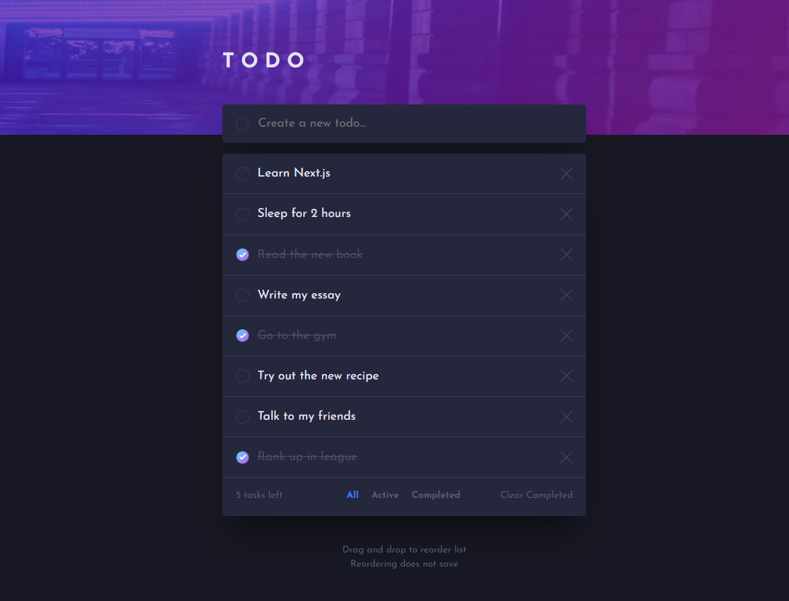

# Frontend Mentor - Todo app solution

This is a solution to the [Todo app challenge on Frontend Mentor](https://www.frontendmentor.io/challenges/todo-app-Su1_KokOW). I have decided to up the challenge and make this a fullstack application.

## Table of contents

- [Overview](#overview)
  - [The challenge](#the-challenge)
  - [Screenshot](#screenshot)
  - [Links](#links)
- [My process](#my-process)
  - [Built with](#built-with)
  - [What I learned](#what-i-learned)
  - [Continued development](#continued-development)
  - [Useful resources](#useful-resources)
- [Author](#author)

## Overview

### The challenge

Users should be able to:

- View the optimal layout for the app depending on their device's screen size
- See hover states for all interactive elements on the page
- Add new todos to the list
- Mark todos as complete
- Delete todos from the list
- Filter by all/active/complete todos
- Clear all completed todos
- **Bonus**: Drag and drop to reorder items on the list

### Screenshot



### Links

- Live Site URL: [Add live site URL here](https://your-live-site-url.com)

## My process

### Built with

- [Express](https://expressjs.com/) - Node framework
- [MongoDB](https://www.mongodb.com/) - Database
- [Mongoose](https://mongoosejs.com/) - MangoDB ORM

### What I learned

Many new technologies have been used in this project. Some were harder to understand than others, but in the end, I think I got a decent grasp on most of them. Of course, by decent grasp, I do not mean that I am proficient with them. To be frank, I am still a newbie, but with the help of documentation and time, I believe I'll be able to achieve whatever I set my mind on.

Let's start with Node and Express! They are super easy to set up and use. The syntax is simple, and the routing functionality is amazing. Separating routes and controllers was helpful, as it improved modularity and code clarity.

Here are some examples:

```js
//---Create express app---
const app = express();

//---Middleware and static files---
app.use(express.static("public"));
app.use(express.json());
app.use(express.urlencoded({ extended: true }));

//---Routing---
app.use(todoRoutes);
```

Here is how I set up the routing (the controllers can be found in separate files):

```js
const express = require("express");
const router = express.Router();
const taskController = require("../controllers/taskController");

router.get("/home", taskController.task_index);
router.post("/home", taskController.task_create);
router.delete("/home", taskController.task_delete);
router.put("/home", taskController.task_updateState);

router.delete("/home/clear", taskController.clearFinished);

module.exports = router;
```

MongoDB and Mongoose were also very fun to use. The ODM was simple yet effective, and the documentation was clear. I tried to pay attention to the backend's response time and attempted to reduce it as much as possible.

Here is an example:

```js
const task_updateState = (req, res) => {
  const id = req.body.id;

  Task.findOneAndUpdate(
    { _id: id },
    [
      {
        $set: {
          state: {
            $cond: [{ $eq: ["$state", "finished"] }, "unfinished", "finished"],
          },
        },
      },
    ],
    { new: true } // Returns the updated document
  )
    .then((updatedDoc) => {
      if (updatedDoc) {
        if (updatedDoc.state === "finished") {
          count--;
        } else {
          count++;
        }
        res.json({ status: "success", state: updatedDoc.state, count: count });
      } else {
        res.status(404).json({ status: "error", message: "Task not found." });
      }
    })
    .catch((err) => {
      res.status(500).json({
        status: "error",
        message: "There was an error updating the state of the task.",
      });
    });
};
```

Initially, this function queried the database for the item based on its ID, after which it would change the state attribute using an if statement. Once changed, the updated object would be saved to the database. This was a relatively slow process, so instead of having two queries, I reduced it to just one using "Task.findOneAndUpdate" and the "$cond:[...]" operator. This reduced the response time by around 50%, which, in my opinion, is impressive.

Another function that was improved in terms of response time is shown below:

```js
const task_index = (req, res) => {
  Promise.all([
    //Run both queries/promises in parallel
    Task.countDocuments({ state: "unfinished" }),
    Task.find(),
  ])
    .then(([number, tasks]) => {
      count = number;
      res.render("index", { title: "My List", tasks: tasks, count: count });
    })
    .catch((err) => {
      console.log(err);
      res.status(500).json({
        status: "error",
        message: "There was an error retrieving the tasks.",
      });
    });
};
```

Instead of having two separate queries (which would be chained), I used Promise.all to have them run in parallel. While this did increase the response time of the server's first cold start, subsequent starts were much faster, improving by around 50%.

Of course, all of this wouldn't be possible if I hadn't become familiar with the fetch API. It's easy to use and quite enjoyable. I still need to study it a bit more, especially the intricacies of await/async.

Here is how I used the fetch API for the removeTask function:

```js
async function removeTask(deleteButton) {
  const elementID = deleteButton.id;

  const response = await fetch("/home", {
    method: "DELETE",
    headers: {
      "Content-Type": "application/json",
    },
    body: JSON.stringify({ id: elementID }),
  });

  const data = await response.json();

  if (data.status === "success") {
    const toRemove = deleteButton.closest(".task-wrapper-menu");

    // Animate the removal of the task
    toRemove.style.transition = "opacity 0.2s";
    toRemove.style.opacity = "0";
    setTimeout(() => {
      toRemove.remove();

      // Update the counter for unfinished tasks
      const countTasks = document.querySelector(".items");
      countTasks.innerHTML = `${data.count} tasks left`;
    }, 200);
  } else {
    // Handle error on the client side
    console.error("Error deleting task:", data.message);
  }
}
```

As a bonus task, I had to create a drag-and-drop feature. This was done using the drag-and-drop API, which, to be honest, was pretty confusing and difficult to use. I think I'll need a lot more practice to become comfortable with it, but the MDN documentation will definitely help.

Here is a snippet of the drag-and-drop code:

```js
function handleDrop(e) {
  e.preventDefault();
  e.stopPropagation();

  if (draggedTask !== this) {
    const allTasks = Array.from(
      taskList.querySelectorAll(".task-wrapper-menu")
    );
    const dragIndex = allTasks.indexOf(draggedTask);
    const dropIndex = allTasks.indexOf(this);

    if (dragIndex < dropIndex) {
      this.insertAdjacentElement("afterend", draggedTask);
      allTasks[dragIndex + 1].insertAdjacentElement("beforebegin", this);
    } else {
      this.insertAdjacentElement("beforebegin", draggedTask);
      allTasks[dragIndex - 1].insertAdjacentElement("afterend", this);
    }

    addDragHandlers(draggedTask);
  }

  return false;
}
```

Unfortunately, because I didn't add a position or count attribute to the schema at the start of the project, it was impossible to save the reordering in the database. This issue will be fixed in a future version. (Although, I might just rewrite this in the future using Next.js and T3...)

### Continued development

One feature I plan to add in the future is the ability to save task reordering in the backend. This can be achieved by modifying the schema to include a "position" attribute for the documents. This way, any change in position on the frontend would be reflected in the backend and saved accordingly. To implement this correctly, every action/function of this todo app (e.g., deletion) needs to be updated.

Additionally, I'm considering adding an authorization feature to allow users to have their own todo lists. This could be accomplished using NextAuth.

### Useful resources

- [Node.js tutorial](https://youtube.com/playlist?list=PL4cUxeGkcC9jsz4LDYc6kv3ymONOKxwBU) - Helped me understand the core concepts of Node and helped me with dipping my toes into express and mongoose.
- [Mongoose Documentation](https://mongoosejs.com/docs/guide.html) - A very useful documentation which helped me clear up any uncertanties that I had.

## Author

- Frontend Mentor - [@GitDoppler](https://www.frontendmentor.io/profile/GitDoppler)
